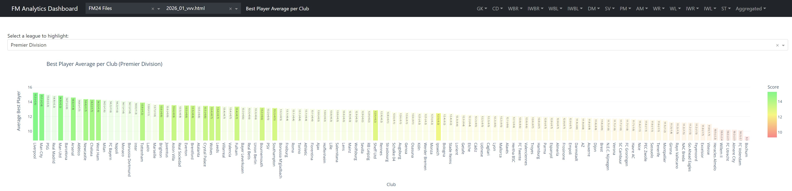
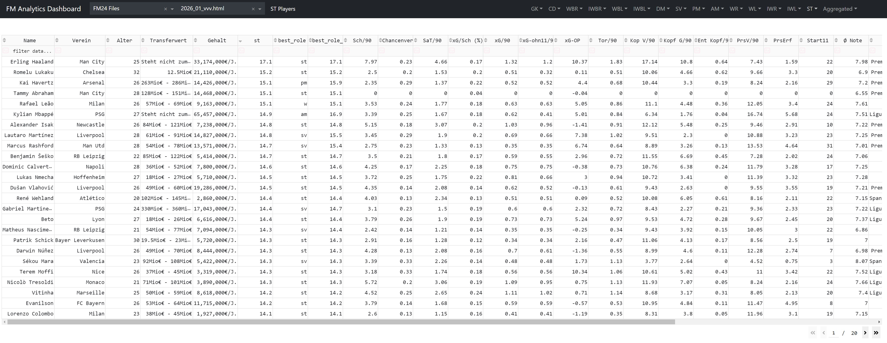
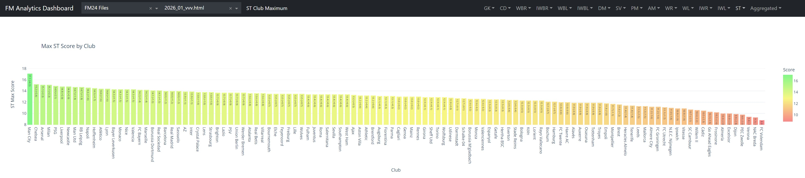
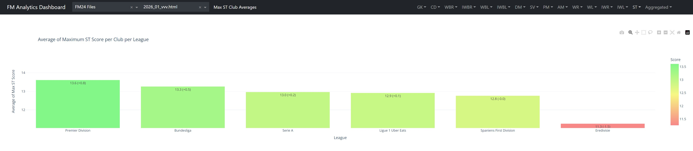
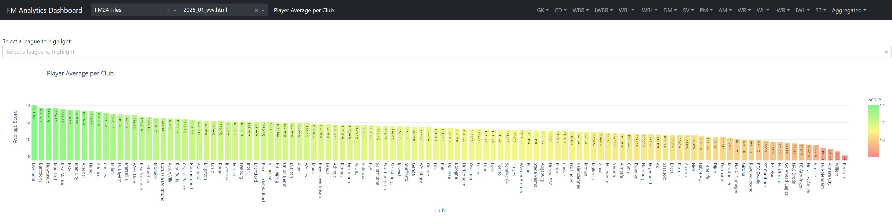
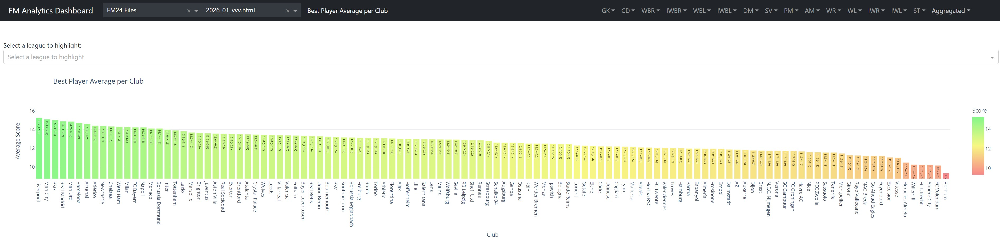
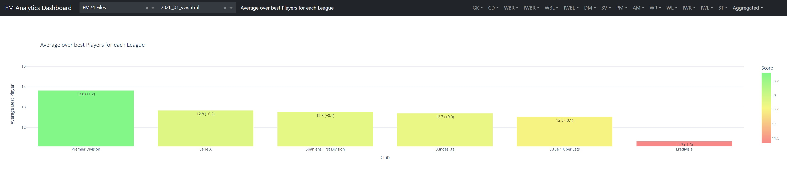

# Fußballmanager 2024 Svonnalytics-Dashboard

*For an English version of this manual, see [README.md](README.md).*

> [!NOTE]  
> Ich hab das Readme mit GPT-4 aus dem Englischen übersetzt und auch das Readme war schon mit GPT-4 teilweise generiert. Kann also passieren dass irgendwo mal Quatsch steht falls es mir beim drüberlesen durchgerutscht ist. 

## Worum geht es?
Willkommen beim Scouting- & Analytics-Dashboard für Football Manager 2024, entwickelt von mir, Svonn. Dieses Tool wurde für "Veni Vidi Vici", ein Online-Multiplayer-Spiel mit über 30 menschlichen Trainern, entworfen. Es berechnet eine Gesamtpunktzahl für Spieler basierend auf Schlüsselattributen und Statistiken, die für ihre Rollen relevant sind. Weitere Details zur Berechnung der Punktzahlen findest du unten. Derzeit ist es notwendig dass alle Attribute sichtbar sind, was in Multiplayer-Spielen üblich ist, da die Spieler zwischen den Spielen keine Zeit haben, ihre Scouts zu verwalten.

## CHANGELOG

**24.11.2023**
* Unterstützung für englische Spiellokalisierung hinzugefügt
* Statistikbasierte Bewertungen, kombinierte Bewertungen, Statistiksets, Leistungsbewertung hinzugefügt
* Viele Verbesserungen bei der Gewichtung von Attributen
* Viele kleinere Korrekturen

## Installation, Start und Stopp

### Installation
**Option 1: Klone das Repository**
   - Wenn du mit Git vertraut bist, klone dieses Repository mit deiner bevorzugten Methode.
   - Für Neulinge in diesem Bereich folge diesen Schritten:
     - Lade Git von [git-scm.com](https://git-scm.com/downloads) herunter und installiere es.
     - Rechtsklick in einem Ordner -> Git Bash öffnen
     - Führe diesen Befehl aus: `git clone git@github.com:Svonn/FM-Svonnalytics-Dashboard.git`.

**Option 2: Download als ZIP**: 
   - Alternativ kannst du dieses Repository als ZIP-Datei herunterladen.
   - Entpacke die Datei an deinem gewünschten Ort auf deinem Computer.

### Starten des Dashboards
- Führe `svonnalytics_dashboard.bat` aus.
- Dadurch werden alle notwendigen Softwareabhängigkeiten automatisch installiert und das Dashboard gestartet.
- Während des Startvorgangs wirst du aufgefordert, einen Pfad einzugeben, an dem du deine Spielerdaten speichern möchtest. Du kannst den Standard verwenden oder deinen eigenen festlegen.

### Beenden des Dashboards
- Um das Programm zu schließen, drücke `Strg+C` in der Konsole oder schließe einfach das Konsolenfenster.

## Daten laden

1. **Im Football Manager 2024**:
   - Gehe zur Scout-Registerkarte.
   - Rechtsklicke auf die Spalten und wähle "Ansicht importieren".
   - Importiere die Ansicht namens `svonnalytics_view.fmf`, die sich in `views_and_filters/` befindet.

2. **Spieler filtern**:
   - Für unser Multiplayer-Spiel "Veni Vidi Vici" verwende den Filter `vvv_relevant_players_filter.fmf` in `views_and_filters/`. Dieser filtert irrelevante Spieler basierend auf Liga-Beteiligung und Kaderstatus.
   - Beim Scouting von Spielern empfehle ich, den Filter "Interessiert an Transfers" oder "Interessiert an Leihen" zu klicken. Wenn das immer noch zu viele Spieler (mehr als 5000) sind, empfehle ich, nach etwas anderem zu filtern, z.B. alle Stats -> erfordere 15 -> mindestens 7/x Match. Passe dies je nach Liga, Status usw. deines Teams an.

3. **Spieler exportieren**:
   - Wähle die Spieler aus, die du exportieren möchtest (verwende `Strg+A` für alle).
   - Drücke `Strg+P` und exportiere sie als Website/HTML-Datei in das Ausgabeverzeichnis, das du beim Start ausgewählt hast (Standard ist `%USERPROFILE%\Dokumente\Sports Interactive\Football Manager 2024\exported_html`).

4. **Verwenden des Dashboards**:
   - Sobald die HTML-Datei fertig ist, kannst du sie oben im Dashboard auswählen.

> [!IMPORTANT]  
> * Um deine eigenen Spieler einzubeziehen, gehe zum Filtermenü, wähle "ausschließen" und deaktiviere "DEIN KLUB - Spieler".
> * Wenn das Dashboard die HTML nicht lädt, stelle sicher, dass du die richtige Ansicht ausgewählt hast. Wenn Probleme weiterhin bestehen, überprüfe die exportierte HTML auf leere Zeilen - ein bekanntes Problem in FM, versuche die Menge der exportierten Spieler zu reduzieren.

## Einschränkungen

Denke daran, Football Manager ist ein komplexes Spiel und Erfolg hängt von verschiedenen Faktoren ab. Dieses Tool bietet Einblicke, kann aber nicht alle Nuancen des Spiels vollständig erfassen.

## Wie die Punktzahl berechnet wird

Für jede Rolle habe ich die wichtigsten Attribute basierend auf meinen Erfahrungen in FM gewichtet. Einige stimmen mit der Gewichtung überein, die FM für die Rollen vorschlägt, während andere vollständig abweichen. Fühl dich frei, sie nach Belieben zu ändern. Zusätzlich zu diesem gewichteten Durchschnitt gibt es eine kleine exponentielle Strafe für Schlüsselattribute, die kleiner als 14 sind. Das bedeutet im Wesentlichen, dass der Unterschied zwischen 14 und 16 im Abschluss weniger wichtig ist als zwischen 10 und 12. Der Einfluss ist jedoch eher gering, was hauptsächlich körperlich überlegene Verteidiger korrigiert, die angeblich extrem gute Stürmer sind, trotz eines Abschlusswerts von 4. Dieser Effekt skaliert auch mit dem zugewiesenen Gewicht.

## Anpassen

- Du kannst die Attributgewichtungen und angezeigten Statistiken für jede Rolle in `configurations.py` anpassen.
- Um eine neue Rolle hinzuzufügen, folge diesen Schritten:
  - Füge einen Eintrag in `role_attributes` in `configurations.py` hinzu.
  - Falls zutreffend, füge die Links-/Rechts-Zuordnung darunter hinzu (wie bei anderen Flügelspielern).
  - Füge die Rolle zu `role_mapping` mit relevanten Positionen hinzu.
- Speichere die Datei - die Rolle sollte jetzt in deinem Dashboard erscheinen.

## Übersicht der Dashboard-Tabs

### Standardbildschirm
- **Beschreibung**: Dieser Bildschirm zeigt alle Spieler sortiert nach ihrer besten Rollenpunktzahl, unabhängig davon, ob sie diese Rolle tatsächlich spielen können. Es beinhaltet Punktzahlen für jede Rolle und zusätzliche Spielerinformationen.
 

### Role -> Player
- **Beschreibung**: Dieser Tab zeigt alle exportierten Spieler, die die ausgewählte Rolle spielen können. Es bietet die Rollenpunktzahl zusammen mit relevanten Statistiken.
 

### Role -> Club Averages

- **Beschreibung**: Zeigt die durchschnittlichen Punktzahlen für jede Rolle über alle Spieler eines Vereins. Nützlich, um einen allgemeinen Überblick über die Stärken eines Vereins in spezifischen Rollen zu bekommen.
 

### Role -> Club Best
- **Beschreibung**: Zeigt die beste Punktzahl für eine spezifische Rolle innerhalb jedes Vereins und hebt den Top-Performer in jeder Rolle hervor.
 

### Role -> League Averages
- **Beschreibung**: Dieser Tab präsentiert die durchschnittlichen Punktzahlen für jede Rolle über die gesamte Liga und bietet Einblicke in ligaübergreifende Trends und Standards.
 

### Role -> League Best
- **Beschreibung**: Zeigt den Durchschnitt der besten Punktzahlen für jeden Verein in der Liga für eine bestimmte Rolle und stellt Top-Talente in jeder Rolle über die Liga hinweg dar.
 

### Aggregated -> Club Overall Scores
- **Beschreibung**: Zeigt den Durchschnitt der "Vereinsdurchschnitt"-Punktzahlen für jede Rolle und gibt einen Überblick über die Gesamtstärke eines Vereins in verschiedenen Rollen.
 

### Aggregated -> Club Max Scores
- **Beschreibung**: Dieser Tab zeigt den Durchschnitt der "Vereinsbest"-Punktzahlen für jede Rolle und gibt die Spitzenleistungsniveaus innerhalb eines Vereins an.
 

### Aggregated -> League Overall Scores
- **Beschreibung**: Präsentiert ligaübergreifende Durchschnitte für jede Rolle, sodass du die Gesamtstärken der Rollen über die Liga hinweg vergleichen kannst.
 

### Aggregated -> League Max Scores
- **Beschreibung**: Zeigt den Durchschnitt der besten Punktzahlen für jede Rolle über alle Vereine in der Liga, was ungefähr der durchschnittlichen besten Startelf in einer Liga entsprechen sollte.
 

## Viel Spaß!