# Football Manager 2024 Svonnalytics Dashboard

*Für eine deutsche Version dieser Anleitung, siehe [LIESMICH.md](LIESMICH.md).*

> [!NOTE]  
> This article has been partly generated via GPT-4 based on some note I have asked it to include. No guarantees that it did not mess up some details here and there.

## What is this about?
Welcome to the Scouting & Analytics Dashboard for Football Manager 2024, developed by me, Svonn. This tool was designed for "Veni Vidi Vici", an online multiplayer save game with over 30 human trainers. It calculates an overall score for players based on key attributes and statistics relevant to their roles. Further details on how scores are calculated are provided below.

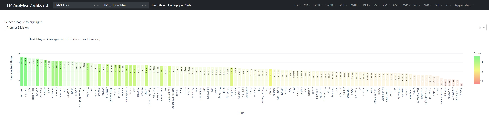

## CHANGELOG

**25.11.2023**
* New amazing installer: Run svonnalytics_dashboard.bat from anywhere, and it will make sure to get all the files you need!
* Added support for HTML files that only include one or a few roles, now dynamically updates the available drop downs
* Now supports save games with non-revealed attributes. It will now user the upper- and lower limits for the calculated score!

**24.11.2023**
* Added support for english game localization
* Added statistics-based scores, combined scores, statistic sets, performance rating
* Lots of attribute weighting improvements
* Lots of minor fixes

## Installing, Starting, and Stopping

### Installation
   **Option 1: Use the installer**
   Let this installer do all the work: [Download svonnalytics_dashboard.bat](https://github.com/Svonn/FM-Svonnalytics-Dashboard/releases/download/Alpha-1.0/svonnalytics_dashboard.bat)

   **Option 2: Clone the Repository** 
   - If you're familiar with Git, clone this repository using your preferred method.
   - For those new to this, follow these steps:
     - Download and install Git from [git-scm.com](https://git-scm.com/downloads).
     - Right click in a directory -> Open Git Bash 
     - Run this command: `git clone git@github.com:Svonn/FM-Svonnalytics-Dashboard.git`.

   **Option 3: Download as ZIP**
   - Alternatively, you can download this repository as a ZIP file.
   - Unzip the file to your desired location on your computer.
   - NOT RECOMMENDED: This won't allow the installer to do the updates automatically!

### Starting the Dashboard
- Run `svonnalytics_dashboard.bat`.
- This will automatically install all necessary software dependencies and start the dashboard.
- During the startup, you'll be prompted to enter a path for where you want to keep your player data. You can use the default or specify your own.

### Stopping the Dashboard
- To close the program, press `Ctrl+C` in the console or simply close the console window.

## Loading Data

1. **In Football Manager 2024**:
   - Go to the scouting tab.
   - Right-click the columns and select "Import view".
   - Import the view named `svonnalytics_view.fmf` located in `views_and_filters/`.

2. **Filtering Players**:
   - For our multiplayer game "Veni Vidi Vici", use the filter `vvv_relevant_players_filter.fmf` in `views_and_filters/`. This filters out irrelevant players based on league participation and squad status.
   - When scouting for players I'd recommend clicking the filter "Interested in Transfers" or "Interested in Loans". If that doesn't remove enough players (Still >5000), then I'd recommend filtering by something like adding all stats -> require 15 -> at least 7/x match. Adjust this depending on your teams league, status etc.

3. **Exporting Players**:
   - Select the players you wish to export (use `Ctrl+A` for all).
   - Press `Ctrl+P` and export them as a website/html file to the output directory you have selected during startup (default is `%USERPROFILE%\Documents\Sports Interactive\Football Manager 2024\exported_html`).

4. **Using the Dashboard**:
   - Once the HTML file is ready, you can select it at the top of the dashboard.

> [!IMPORTANT]  
> * To include your own players, go to the filter menu, select "exclude", and uncheck "YOUR CLUB - Players".
> * If the dashboard fails to load the HTML, ensure you have selected the correct view. If issues persist, check the exported HTML for empty rows - a known issue in FM, try to reduce the amount of exported players.

## Limitations

Remember, Football Manager is a complex game and success depends on various factors. This tool offers insights but cannot fully capture the game's nuances.

## How the score is calculated.

For each role, I have weighted the most important attributes based on my FM experiences. Some align with the weighting that FM proposes for the roles, while others deviate completely. Feel free to change them as much as you like. In addition to that weighted average, there is a small exponential penalty on key attributes smaller than 14. That basically means that the difference between having 14 or 16 in finishing is less important than having 10 or 12. The impact is rather low, however, which mostly corrects physically overwhelming defenders who are allegedly extremely good strikers, despite having 4 finishing. This effect also scales with the assigned weight.

## Customizing

- You can adjust attribute weightings and displayed stats for each role in `configurations.py`.
- To add a new role, follow these steps:
  - Add an entry in `role_attributes` in `configurations.py`.
  - If applicable, add the left/right mapping below (like for other wingers).
  - Add the role to `role_mapping` with relevant positions.
- Save the file - the role should now appear in your dashboard.

## Dashboard Tabs Overview

### Default Screen
- **Description**: This screen displays all players sorted by their best role score, irrespective of whether they can actually play that role. It includes scores for each role and additional player information.
 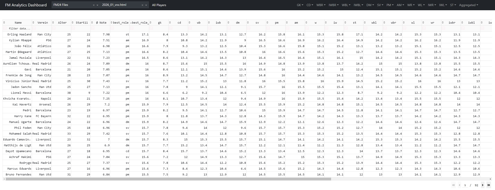

### Role -> Player
- **Description**: This tab shows all exported players capable of playing the selected role. It provides the role score along with relevant statistics.
 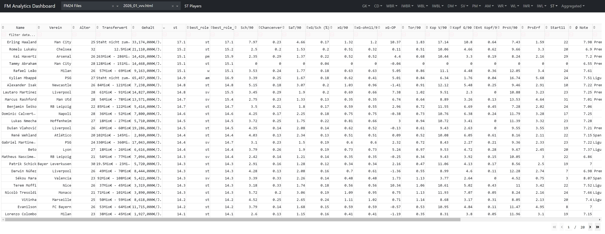

### Role -> Club Averages
- **Description**: Displays the average scores for each role across all players in a club. Useful for getting a general idea of a club's strengths in specific roles.
 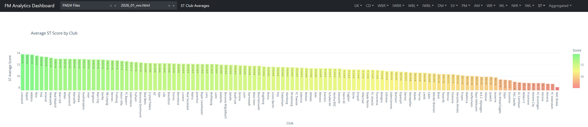

### Role -> Club Best
- **Description**: Shows the best score for a specific role within each club, highlighting the top performer in each role.
 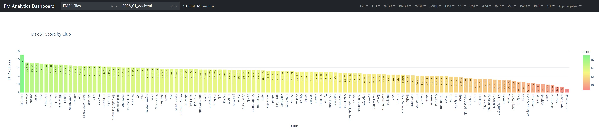

### Role -> League Averages
- **Description**: This tab presents the average scores for each role across the entire league, offering insights into league-wide trends and standards.
 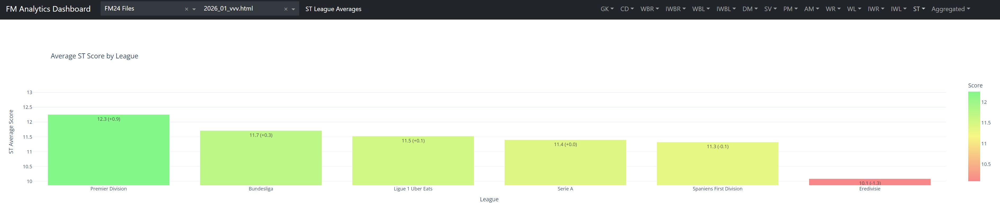

### Role -> League Best
- **Description**: Displays the average of the best scores for each club in the league for a particular role, showcasing top talent in each role across the league.
 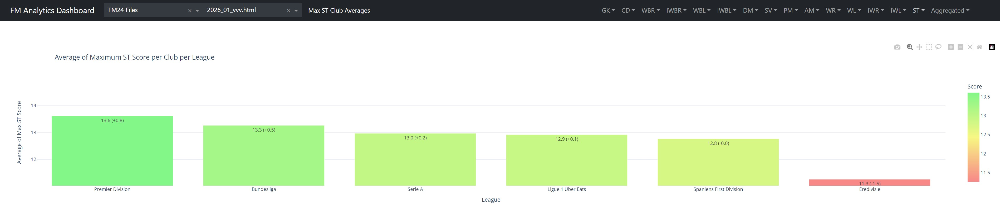

### Aggregated -> Club Overall Scores
- **Description**: Shows the average of "Club Average" scores for each role, giving an overview of a club's overall strength in various roles.
 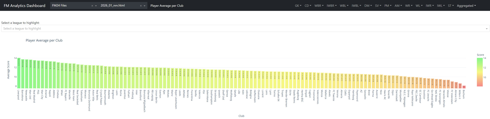

### Aggregated -> Club Max Scores
- **Description**: This tab displays the average of the "Club Best" scores for each role, indicating the peak performance levels within a club.
 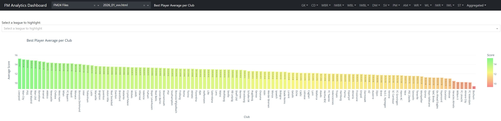

### Aggregated -> League Overall Scores
- **Description**: Presents league-wide averages for each role, allowing you to compare overall role strengths across the league.
 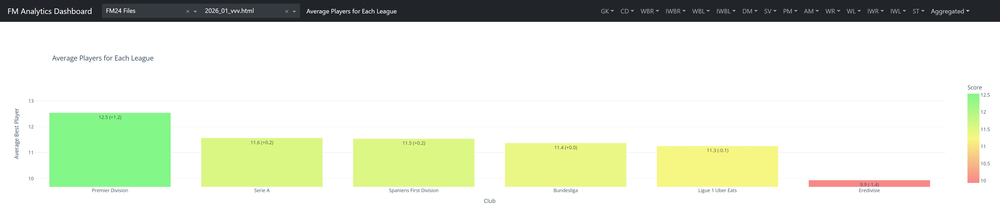

### Aggregated -> League Max Scores
- **Description**: Shows the average of the best scores for each role across all clubs in the league, which should roughly resemble the average best starting eleven in a league.
 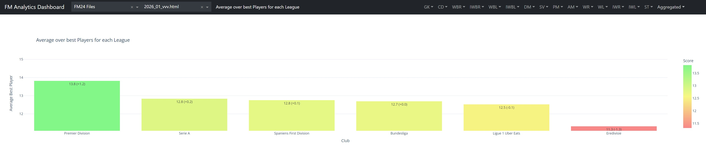

## Have Fun!